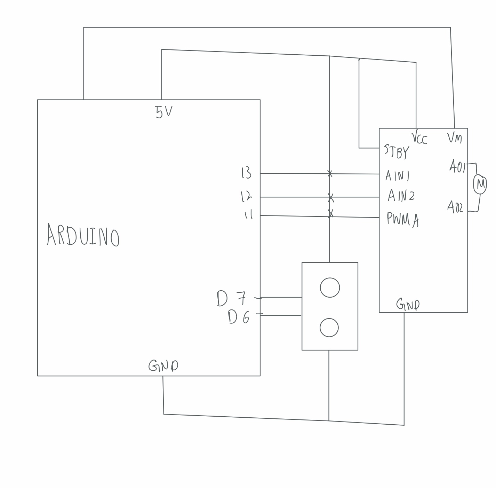
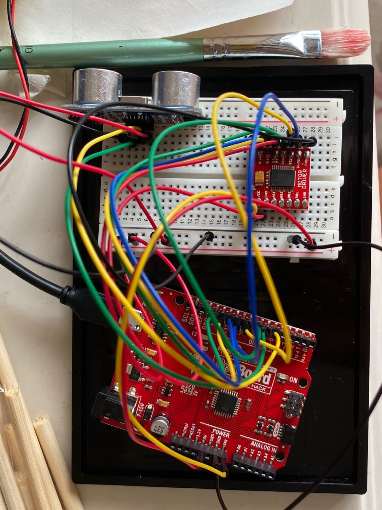

In my final project, I decided to make an artwork that interact with people when they are observing it. 

- inspiration

I was interested in the idea a wind bell. In my culture, It is something that you hang near the window in summer. When the wind blows, it makes soft noise that will make you feel 'cool'. It reminds you of the summer breeze. 

For the artwork that I want to make for my final project, I want to incorporate that romantic and joyful element of a wind bell. However, nowadays, we are always sitting inside AC with our window closed. The wind bell becomes silent because there is no natural wind. The wind bell that I make reacts to people passing by it and create a soft noise by turning. 

- Project description 

The construction of the project is fairly simple. On the Arduino broad, I have a DC motor and an ultrasonic sensor connected. The DC motor is connected to a wheel and the wind bell I made. The ultrasonic sensor will detect the distance of the object around the bell, so when people walk past it, it will turn and make soft noise. I set a condition that if the object is further than 50cm from the bell, the bell won't turn. Otherwise, if there is an object/person passing the bell from  0-50cm, the sensor will detects it and start the motor from turning. 

Processing is used as a control in this project. On the processing, I created a canvas with width 255. The value of mouseX that is detected from processing will be sent to Arduino as the speed of the motor. So when the mouse is on the very left side of the canvas, the motor doesn't turn or turns very slow. It turns faster and faster when you hover your mouse towards the right. For the user to understnad how to use it, I drew a little image that indicates where to move the mouse 

