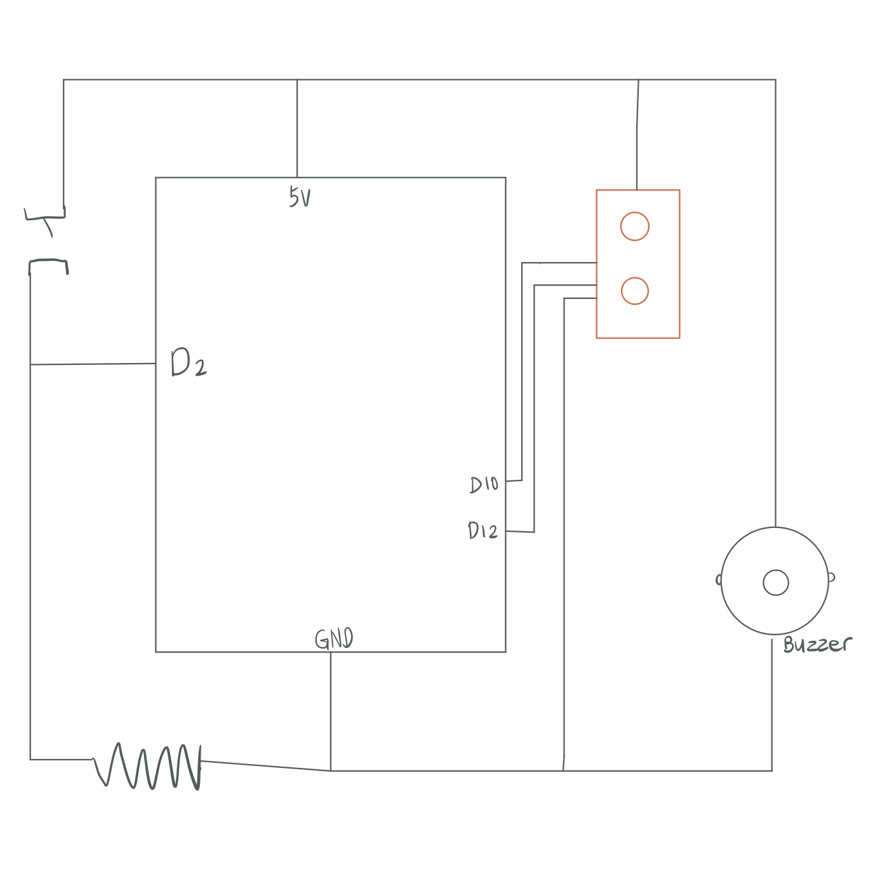

For this project, We are asked to make a music instrument with one digital sensor and one analog sensor.

I was planning to make a Wind chimes with my motor, however, I realized my motor broke and it is heating up really hot. I checked the circuit and the code, nothing is wrong. I think i broke it yesterday by rotating it by hands.

So I ended up making a very basic instrument detects the distance of the hands and plays different sounds.

Here is a link to the video :https://drive.google.com/file/d/1uy6ujxHcsIH_ehITJc9oheOP2KAsa1h0/view?usp=sharing
