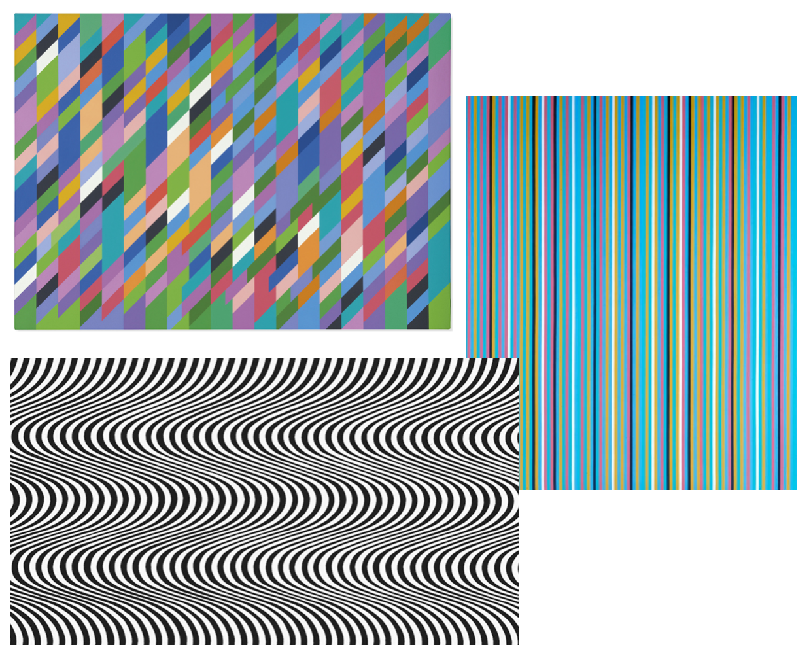
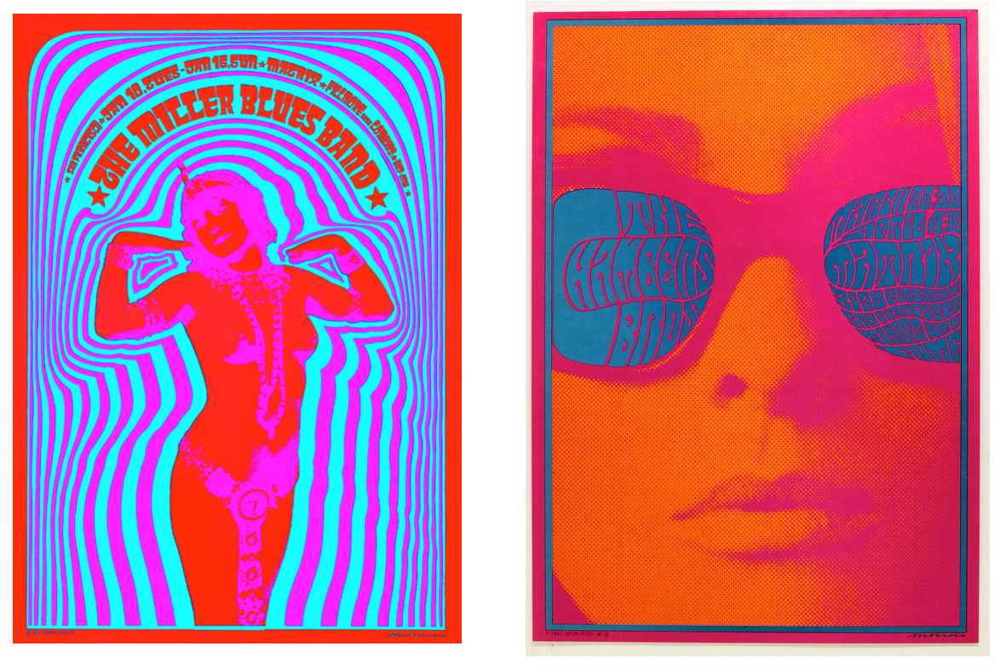
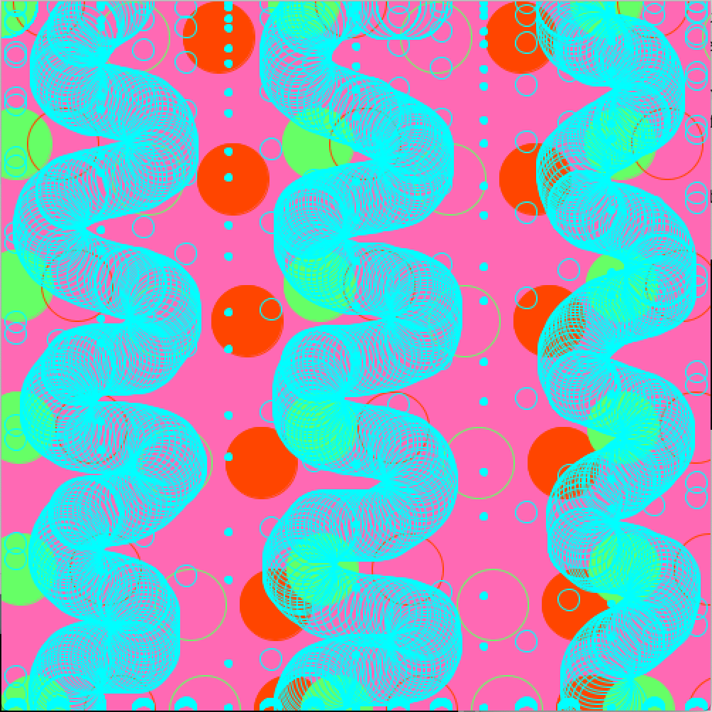

When I was taking a class on the Art in the 60s, I was very interested in Psychedelics art. 
In 2005, Christoph Grunenberg organized an exhibition fifty years later in Liverpool called Summer of Love: Art of the Psychedelic Era. In the catalog, he depicted the essence of Psychedelics art: 

- “Psychedelic art attempts to capture these fantastic visions, creatures, and landscapes. It is a visionary art….It opens the door to new universes, captures the flights of the imagination and often has a deeply mystical and religious quality.” 

Andy Warhol experimented with the psychedelic effect of multimedia art-making by hosting light shows. He aims to re-shape the experience of multi-media art by composing flashy, flickering, distorted images together. The light shows also uses bright fluorescent colors that drown the audience in a psychedelic environment. 

When I saw the old magazine of computer graphics and art, It reminded me of this genre of art created by the artists in the 60s. So I decided to make my computer graphics inspired by this art movement 

I found some inpsirations online from serval important artists from this movement : 
- Artworks by Bridget Riley

  
- Artworks by Victor Moscoso

- This is my final result: 

I found it really fun to play with all the shapes and colors. I really like the colors I choose to play with. However, I still find my code quite long and messy. 
