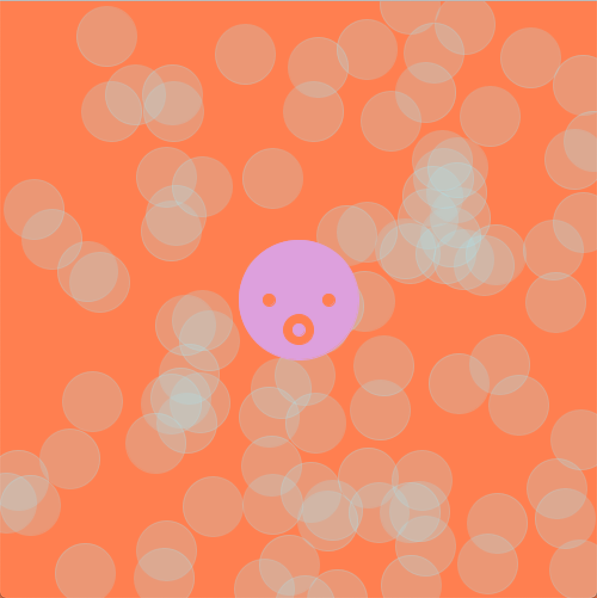

For this project, I experienmented with Object Oriented Programming. I am new to programing so it was quite confusing for me to make everything work.

So I decided that I will follow the youtube tutorial so I can practice and understand this completely new knowledge. 
I was planning to make the octopus's leg move. I used a sin wave, however, I dont know how to make the leg move from one same point towards diffferent directions.

I realized from my last project, I was writing the codes repeatly to duplicate the object, however, with this method, it is so much easier to change the number of objects as I want. 

The bubbles moves from down to up. Please see from the video I uploaded in the June3 folder. 
