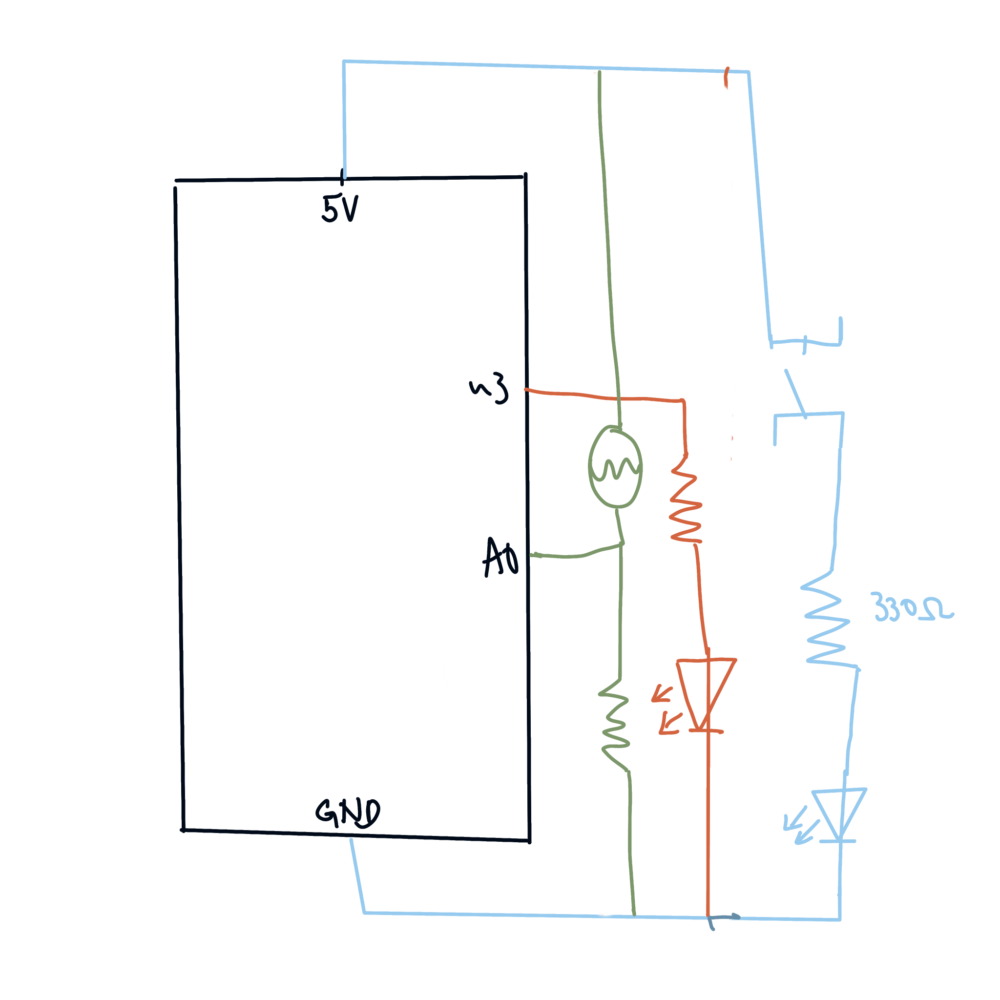

Remember those times that you want to go to the bathroom at night but you cannot find the switch? I want to create a simple tool that helps with that inconvenience. This tool will have two LEDs, one LED is to indicate the switch for the other LED. So I want to have one LED that turns on when the surrounding is dark and turns off when the surrounding is bright. And the other LED is controlled by the switch. So in reality the other LED is our big lightbulb. 

